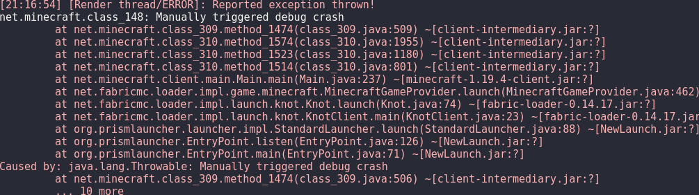
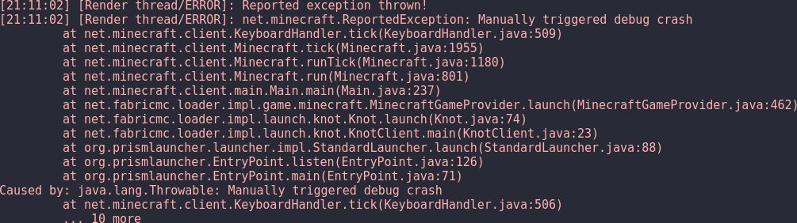

# Stack Deobfuscator

**Note: By using this mod you agree to the license of mojang mappings:**

(c) 2020 Microsoft Corporation.These mappings are provided "as-is" and you bear the risk of using them. You may copy and
use the mappings for development purposes, but you may not redistribute the mappings complete and unmodified. Microsoft
makes no warranties, express or implied, with respect to the mappings provided here. Use and modification of this
document or the source code (in any form) of Minecraft: Java Edition is governed by the Minecraft End User License
Agreement available at https://account.mojang.com/documents/minecraft_eula.

## What does this mod do?

### Before



### After



All throwables logged using the log4j root logger will be remapped from intermediary mappings to mojang mappings.
This allows mod developers to more easily spot issues in a non-development environment as the errors are instantly
human-readable.

**Note:** This mod downloads mojang and intermediary mappings once on startup.

## Compatibility

This mod only injects at a few places for crash reports to be remapped and only uses one vanilla method for getting the
current minecraft version, so this mod should be compatible with most (future) minecraft versions.

## Building

```shell
./gradlew build # remove "./" on windows
```

The output jar can be found in `build` –> `libs`.
